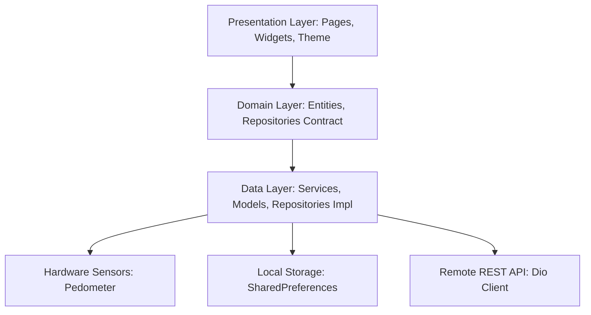

# 🏃‍♂️ Health Tracker App - Flutter Mobile & Web

<p align="center">
  
  
  
  
  
  
</p>

---

## 📌 Tentang Proyek

**Health Tracker App** adalah aplikasi pelacak kesehatan modern berbasis **Flutter** yang dirancang untuk memantau berbagai aktivitas gaya hidup sehat pengguna secara harian. Aplikasi ini menyediakan fitur pemantauan komprehensif mulai dari **penghitung langkah otomatis (*Step Counter*) menggunakan sensor Pedometer**, **pola dan durasi tidur (*Sleep Tracker*)**, **asupan air minum harian (*Water Intake*)**, **pencatatan makanan & kalori (*Food & Calorie Tracker*)**, **detak jantung (*Heart Rate*)**, hingga **artikel edukasi kesehatan (*Health News*)**.

Dibangun dengan arsitektur modular (*Feature-Driven & Clean Architecture*), desain antarmuka modern yang estetik menggunakan **Google Fonts (Poppins)**, **Font Awesome Icons**, dan visualisasi data interaktif dengan **fl_chart** serta **percent_indicator**.

---

## 📱 Tampilan Antarmuka (Preview)

| Dashboard & Mood Tracker | Food Tracker | News & Artikel | Profil & Statistik |
| :---: | :---: | :---: | :---: |
| <sub>*Ringkasan Kalori, Streaks, & Mood*</sub> | <sub>*Pencatatan Makanan & Kalori*</sub> | <sub>*Edukasi & Tips Sehat*</sub> | <sub>*Target & Pencapaian*</sub> |

---

## ✨ Fitur-Fitur Utama

### 🏠 1. Dashboard Utama & Home Interaktif
- **Header Personalisasi**: Menampilkan nama pengguna, lonceng notifikasi, dan tombol pengaturan.
- **Banner Kalori Harian**: Kartu ringkasan jumlah kalori yang terbakar secara *real-time* (*"Kalori Terbakar 450 kcal Hari Ini"*).
- **Sistem Streaks (Konsistensi Harian 🔥)**:
  - 🌙 **Sleep Streak**: Menghitung konsistensi jam tidur harian.
  - 💧 **Water Streak**: Menghitung konsistensi pemenuhan target air minum.
  - 👣 **Steps Streak**: Menghitung konsistensi pencapaian target langkah.
- **Perekam Mood Harian (*How are you feeling?*)**:
  - Pilihan ekspresi emosi harian: **Sad** (😭), **Down** (🙁), **Okay** (😐), **Good** (😊), dan **Great** (😄).
- **Pencapaian Mingguan (*Weekly Goal*)**: Progress bar persentase pencapaian target mingguan.

---

### 🚶‍♂️ 2. Step Tracker (Penghitung Langkah Sensor Pedometer)
- **Sensor Hardware Pedometer**: Mendeteksi dan menghitung langkah kaki pengguna secara otomatis langsung dari sensor perangkat.
- **Progress Lingkaran Interaktif**: Menggunakan `CircularPercentIndicator` untuk memvisualisasikan progres menuju target langkah harian (misal: 10.000 langkah).
- **Statistik & Grafik**: Visualisasi riwayat langkah per hari/minggu menggunakan `fl_chart`.

---

### 🥗 3. Food & Calorie Tracker
- **Pencatatan Makanan**: Kategori makanan untuk Sarapan (*Breakfast*), Makan Siang (*Lunch*), Makan Malam (*Dinner*), dan Camilan (*Snack*).
- **Kalkulasi Kalori Masuk vs Target**: Menghitung total kalori harian untuk menjaga pola defisit atau surplus kalori.
- **Smart Trigger**: Notifikasi otomatis saat kalori melebihi atau belum mencapai target.

---

### 💧 4. Water Intake Tracker
- **Pencatatan Gelas Air**: Menghitung jumlah konsumsi air harian (contoh: target 8 gelas/hari).
- **Water Reminder**: Pengingat berkala untuk minum air agar tubuh tetap terhidrasi.

---

### 🌙 5. Sleep Tracker (Pelacak Tidur)
- **Durasi & Kualitas Tidur**: Memantau jam tidur malam dan target durasi tidur sehat (contoh: target 8 jam).
- **Sleep Time Reminder**: Pengingat otomatis saat mendekati jadwal jam tidur ideal (pukul 22.00).

---

### ❤️ 6. Heart Rate Monitor
- Pemantauan denyut jantung (*Resting Heart Rate*) dengan indikator status kondisi detak jantung normal.

---

### 📰 7. Health News & Edukasi
- Kumpulan artikel, tips diet, pola hidup sehat, dan berita kesehatan terkini.

---

### 🔔 8. Sistem Notifikasi Otomatis (Periodic Reminder)
- Dilengkapi `NotificationService` yang berjalan periodik untuk memantau dan memberikan pengingat cerdas bagi pengguna:
  - ⏰ Pengingat jam tidur malam.
  - 💧 Pengingat minum air jika sudah lama tidak minum.
  - 🥗 Pengingat asupan kalori seimbang.

---

## 🏗️ Arsitektur Aplikasi

Aplikasi menerapkan pola **Clean Architecture & Feature-Driven Development**:



---

## 📂 Struktur Direktori Proyek

```text
lib/
├── core/
│   ├── app_colors.dart         # Palet warna aplikasi (Teal, Mint, Pastel, Dark Text)
│   ├── app_constants.dart      # Konstanta target harian & default config
│   ├── app_text_styles.dart    # Gaya tipografi Google Fonts (Poppins)
│   ├── icons/
│   │   └── custom_icons.dart   # Definisi ikon kustom
│   ├── theme/
│   │   └── app_theme.dart      # ThemeData Light & Dark konfigurasi
│   └── widgets/
│       ├── circular_chart.dart     # Widget grafik circular progress
│       ├── feature_card.dart       # Widget kartu fitur dashboard
│       ├── health_stat_card.dart   # Widget kartu metrik statistik
│       ├── line_chart_widget.dart  # Widget grafik garis fl_chart
│       └── notification_widget.dart# Wrapper notifikasi aplikasi
├── data/
│   ├── model/                  # Data Models (JSON Serialization)
│   │   ├── air.dart            # Model data asupan air
│   │   ├── langkah.dart        # Model data langkah
│   │   ├── makanan.dart        # Model data makanan & kalori
│   │   ├── tidur.dart          # Model data tidur
│   │   └── user.dart           # Model data profil pengguna
│   ├── repository/
│   │   └── health_repository.dart
│   └── services/               # Layanan bisnis & background tasks
│       ├── air_service.dart
│       ├── health_service.dart
│       ├── langkah_service.dart
│       ├── makanan_service.dart
│       ├── notification_service.dart # Background timer & smart reminders
│       └── tidur_service.dart
├── features/                   # Modul Fitur Berbasis Fitur (Feature-Driven)
│   ├── dashboard/              # Modul Beranda & Navigasi
│   │   └── presentation/pages/
│   │       ├── dashboard_page.dart
│   │       ├── home_page.dart            # Halaman Beranda (Streaks, Kalori, Mood)
│   │       ├── main_navigation_page.dart # Bottom Navigation Bar
│   │       ├── notification_demo_page.dart
│   │       ├── pencapaian_page.dart      # Halaman badge & achievement
│   │       └── profil_page.dart          # Halaman profil pengguna
│   ├── food/                   # Modul Makanan & Kalori
│   │   └── presentation/pages/
│   │       ├── food_tracker_page.dart
│   │       └── makanan_page.dart
│   ├── heart_rate/             # Modul Detak Jantung
│   │   └── presentation/pages/
│   │       └── heart_rate_page.dart
│   ├── news/                   # Modul Berita Kesehatan
│   │   └── presentation/pages/
│   │       └── news_page.dart
│   ├── sleep/                  # Modul Pelacak Tidur
│   │   └── presentation/pages/
│   │       └── tidur_page.dart
│   ├── steps/                  # Modul Langkah Kaki & Pedometer
│   │   ├── data/
│   │   │   ├── datasources/pedometer_service.dart
│   │   │   └── repositories/step_repository_impl.dart
│   │   ├── domain/
│   │   │   ├── entities/step_entity.dart
│   │   │   └── repositories/step_repository.dart
│   │   └── presentation/
│   │       ├── pages/langkah_page.dart & steps_page.dart
│   │       └── widgets/step_progress_widget.dart
│   └── water/                  # Modul Asupan Air
│       └── presentation/pages/
│           └── air_page.dart
├── helpers/
│   ├── api_client.dart         # HTTP Client (Dio)
│   └── user_info.dart          # Sesi pengguna (SharedPreferences)
├── routes/
│   └── app_routes.dart         # Pengaturan rute & navigasi aplikasi
└── main.dart                   # Entry point aplikasi Flutter
```

---

## 🛠️ Tech Stack & Pustaka

| Kategori | Paket / Pustaka | Versi | Kegunaan |
|---|---|---|---|
| **Framework** | [Flutter](https://flutter.dev/) | `^3.7.2` | Framework UI Multiplatform |
| **Language** | [Dart](https://dart.dev/) | `^3.7.2` | Bahasa pemrograman utama |
| **Typography** | [google_fonts](https://pub.dev/packages/google_fonts) | `^6.1.0` | Font Poppins & tipografi modern |
| **Data Viz** | [fl_chart](https://pub.dev/packages/fl_chart) | `^0.68.0` | Grafik statistik (Line/Bar charts) |
| **Progress UI** | [percent_indicator](https://pub.dev/packages/percent_indicator) | `^4.2.3` | Circular & Linear progress bar |
| **Sensor** | [pedometer](https://pub.dev/packages/pedometer) | `^4.0.1` | Sensor pendeteksi langkah kaki fisik |
| **Icons** | [font_awesome_flutter](https://pub.dev/packages/font_awesome_flutter) | `^10.7.0` | Set ikon kesehatan & gaya hidup |
| **Animation** | [lottie](https://pub.dev/packages/lottie) | `^3.1.0` | Animasi interaktif vector |
| **Networking** | [dio](https://pub.dev/packages/dio) | `^5.9.0` | HTTP Client untuk integrasi API |
| **Local Storage**| [shared_preferences](https://pub.dev/packages/shared_preferences) | `^2.5.3` | Penyimpanan data preferensi & sesi |
| **Date Utility**| [intl](https://pub.dev/packages/intl) | `^0.19.0` | Format tanggal & angka lokal |

---

## 🚀 Panduan Menjalankan Aplikasi

### 1. Prasyarat Sistem
- **Flutter SDK** (versi `^3.7.2` atau terbaru)
- **Dart SDK** (terintegrasi dalam Flutter)
- **Android Studio** / **VS Code** (dengan ekstensi Flutter & Dart)
- Android Emulator / Real Device (untuk fitur sensor Pedometer disarankan menggunakan Real Device) / Chrome (Web)

### 2. Clone Repositori
```bash
git clone https://github.com/Luthfi-1012/Health-tracker-mobile.git
cd Health-tracker-mobile
```

### 3. Unduh Dependensi Proyek
```bash
flutter pub get
```

### 4. Menjalankan Aplikasi

- **Pada Android / iOS Real Device / Emulator**:
  ```bash
  flutter run
  ```

- **Pada Web Browser (Chrome)**:
  ```bash
  flutter run -d chrome
  ```

---

## 👤 Pengembang

- **M. Luthfi** - [GitHub Profile](https://github.com/Luthfi-1012)
- Repositori: [Health-tracker-mobile](https://github.com/Luthfi-1012/Health-tracker-mobile.git)

---

## 📄 Lisensi

Proyek ini dibuat untuk keperluan akademik dan portofolio pengembangan aplikasi mobile, dilisensikan di bawah lisensi [MIT](LICENSE).
